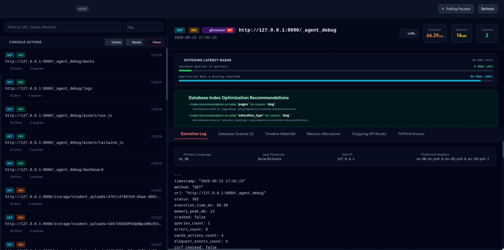

<div align="center">


<br><br>

**A zero-JS, high-fidelity server-side diagnostics & profiling suite for Laravel 12.x / 13.x**

<br>

[](https://packagist.org/packages/clcbws/laravel-agents-debug)
[](https://www.php.net)
[](https://laravel.com)
[](LICENSE)
[](tests/)

</div>

---

## What Is It?

**Laravel Agent-Debugger** is a premium require-dev diagnostic middleware suite that runs 100% server-side. It produces richly structured, compact log files designed to be read by both human developers and AI coding agents — with zero frontend JavaScript overhead, zero Composer runtime dependencies, and zero production leakage.

---

## Quick Start

```bash
composer require --dev clcbws/laravel-agents-debug
php artisan vendor:publish --provider="LaravelAgentDebugger\DebugActivityServiceProvider"
php artisan agent:debug-on
```

Then visit your visual dashboard:

```
http://localhost/_agent_debug/dashboard
```



---

## ✨ Feature Overview (v3.1.1 — 13 Dashboard Tabs & 29 Server-Side Profilers)

### 🔍 Core Diagnostics
| # | Feature | Description |
|---|---------|-------------|
| 1 | 🔴 Floating Viewport Badge | Glassmorphic real-time badge showing duration, memory & query count |
| 2 | 🧭 Session Breadcrumb Trail | Last-10-request navigation map with status codes |
| 3 | 🪝 Caught Exception Tracker | Surfaces silently swallowed `try-catch` redirects |
| 4 | 💳 DB Transaction Auditor | Inline `beginTransaction`, `commit`, `rollBack` sequence logger |
| 5 | ⚠️ N+1 Query Loop Detector | Flags queries running 5+ times with eager-load remedies |
| 6 | 🔄 Config & Env Drift Detector | SHA-256 diff between requests for `.env` key changes |
| 7 | 🖌️ Blade Compiler Resolver | Maps compiled view paths back to physical `.blade.php` lines |
| 8 | 🛡️ Gate & Policy Profiler | Logs all authorization ability evaluations and outcomes |
| 9 | 💾 Session State Logger | Exposes developer-defined session variables per request |
| 10 | 👤 Actor Enrichment Card | Maps authenticated User ID to email/username profile |

### 🗃️ Database & Query Intelligence
| # | Feature | Description |
|---|---------|-------------|
| 11 | 🔬 Visual SQL EXPLAIN Analyzer | Runs `EXPLAIN` on any query and visualizes index scan plans |
| 12 | 👥 Duplicate & Redundant Query Detector | Flags exact duplicate queries with caching advice |
| 13 | 📝 Interactive SQL Playground | Safe read-only live `SELECT` terminal inside the dashboard |
| 14 | 💾 SQL Database Index Advisor | Heuristic `WHERE`/`JOIN` column analysis with migration code |

### 📢 Async & Side-Effect Telemetry
| # | Feature | Description |
|---|---------|-------------|
| 15 | 🎧 Queue Job & Event Payload Serializer | Captures dispatched event/job payloads |
| 16 | 📧 Outgoing Mail Sandbox | Intercepts Mailables and renders HTML previews in-dashboard |
| 17 | 🗂️ Cache Hit/Miss Monitor | Tracks `get`/`put`/`forget` with keys, TTLs, and byte sizes |
| 18 | 🔄 Eloquent Model Lifecycle Tracker | Logs `creating`, `created`, `updating`, `deleting` observers |

### ⏱️ Visual Profiling & Timelines
| # | Feature | Description |
|---|---------|-------------|
| 19 | ⏱️ DevTools-Style Timeline Waterfall | Proportional Gantt chart of Boot → DB → Spans → HTTP |
| 20 | 🗺️ Blade Template Composition Tree | Visual nesting sequence flowchart for view hierarchies |
| 21 | 📊 Live PHP Memory Flame-Graph | Real `memory_get_peak_usage()` layered allocation breakdown |
| 22 | 📊 Outgoing Latency Radar | DB vs app overhead performance ratio meters |

### 🛠️ Environment, Security & DevOps
| # | Feature | Description |
|---|---------|-------------|
| 23 | 🔌 Livewire Hydration State Tracker | Discrete state dumps for Livewire component updates |
| 24 | 🚨 Dev Environment Config Shield | TCP socket checks for Redis and SMTP on `artisan serve` |
| 25 | 🍪 Cookie & CSRF Token Debugger | Demystifies silent 419 Page Expired errors |
| 26 | ⚖️ .env vs .env.example Diff Audit | Side-by-side grid of missing or drifted config keys |
| 27 | 🏷️ Category Tag Filtering (`?_debug_tag=x`) | URL-appended tags for scoped log filtering |
| 28 | 🩹 Composer Security Auditor | CVE advisory scan of `composer.lock` packages |
| 29 | 🚀 Git Branch Correlation Analyzer | Active branch badge and uncommitted file diff warnings |

### 🖥️ Dashboard & Streaming
| # | Feature | Description |
|---|---------|-------------|
| 30 | 🚿 Real-time SSE Log Streaming | Persistent `EventSource` stream with AJAX fallback |
| 31 | 🎭 Outgoing API Mock Interceptor | UI rule builder for `Http::fake()` JSON stubs |
| 32 | 🧪 Browser-Based PHPUnit Runner | One-click in-dashboard test suite executor |
| 33 | 🛠️ Artisan Quick-Console | Cache, route, and debug-clean from the dashboard header |

---

## Artisan CLI Commands

```bash
php artisan agent:debug-on          # Enable profiling
php artisan agent:debug-off         # Disable profiling
php artisan agent:debug-status      # Show current config & storage footprint
php artisan agent:debug-clean       # Purge log files (--days=X optional)
php artisan agent:debug-tail        # Live CLI log stream
php artisan agent:debug-record      # Export session as portable .md/.json bundle
```

---

## Dashboard Routes

| Route | Method | Description |
|-------|--------|-------------|
| `/_agent_debug/dashboard` | GET | Visual SPA profiling dashboard |
| `/_agent_debug/logs` | GET | Raw JSON log data |
| `/_agent_debug/sse` | GET | Server-Sent Events live stream |
| `/_agent_debug/explain` | POST | Run `EXPLAIN` on a SQL query |
| `/_agent_debug/playground` | POST | Execute a safe `SELECT` query |
| `/_agent_debug/run-tests` | POST | Execute PHPUnit feature tests |
| `/_agent_debug/mocks` | GET | List active HTTP mock rules |
| `/_agent_debug/mock-save` | POST | Save HTTP mock interceptor rules |
| `/_agent_debug/artisan/{cmd}` | POST | Run Artisan quick-console commands |

---

## Documentation

- **Vision** – https://ahtesham-clcbws.github.io/laravel-agents-debug/vision
- **Core Features** – https://ahtesham-clcbws.github.io/laravel-agents-debug/features
- **Configuration** – https://ahtesham-clcbws.github.io/laravel-agents-debug/configuration
- **Artisan CLI Guide** – https://ahtesham-clcbws.github.io/laravel-agents-debug/artisan
- **Log Schema** – https://ahtesham-clcbws.github.io/laravel-agents-debug/schema
- **Changelog v3.1.1** – https://ahtesham-clcbws.github.io/laravel-agents-debug/changelogs/v3.1.1
- **Changelog v3.1.0** – https://ahtesham-clcbws.github.io/laravel-agents-debug/changelogs/v3.1.0
- **Changelog v2.9.0** – https://ahtesham-clcbws.github.io/laravel-agents-debug/changelogs/v2.9.0

---

## Origin Story

> *"I developed this package because in some projects I had to spend a lot of time just explaining the problem to my AI coding agents. I started with a lightweight middleware helper and kept adding features. Soon I realized other developers faced the same bottleneck, so I decided to share it with the community. This is an invention of need."* — **Ahtesham**

---

<div align="center">

[](https://packagist.org/packages/clcbws/laravel-agents-debug)

</div>
