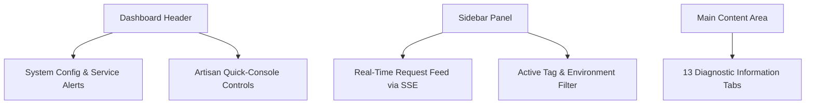

# Visual Dashboard User Guide

The **Laravel Agent-Debugger** includes a zero-dependency, local-only interactive SPA (Single Page Application) dashboard served directly from your application server. It displays real-time execution statistics, query timelines, background job tracing, memory allocation flame-graphs, and integrates a suite of diagnostic utility tools.

---

## 🚀 Accessing the Dashboard

Once the package is installed and enabled (`AGENT_DEBUGGER_ENABLED=true` in `.env`), you can access the dashboard by navigating to:

```http
http://your-local-app-url/_agent_debug/dashboard
```

For standard local development servers, this is typically:
*   [http://127.0.0.1:8000/_agent_debug/dashboard](http://127.0.0.1:8000/_agent_debug/dashboard)
*   [http://localhost/_agent_debug/dashboard](http://localhost/_agent_debug/dashboard)

> [!NOTE]
> The dashboard is strictly locked to local/development environments. In production or non-dev environments with `composer install --no-dev`, the route is completely unregistered to prevent any memory footprint or security risks.

---

## 🎨 Dashboard Interface Tour

The dashboard uses a dark glassmorphic design that runs 100% offline using localized asset routing.



### 1. The Header Panel
*   **VCS Status Badge**: Shows the active Git branch and the count of uncommitted/dirty files. Clicking this alerts you to changes that might affect performance.
*   **Artisan Quick-Console**: Three primary action buttons:
    *   `🧹 Clean Logs`: Purges all compiled profiling logs.
    *   `💾 Clear Cache`: Runs `php artisan cache:clear` to flush app caches.
    *   `🛣️ Clear Routes`: Runs `php artisan route:clear` to refresh routing caches.
*   **Dev Environment Shield**: Displays blinking warning banners if local SMTP/Redis services are configured but unreachable.

### 2. The Request Sidebar (Real-time Feed)
*   Displays a list of recent HTTP requests with color-coded HTTP methods (`GET`, `POST`, `PUT`, `DELETE`, `PATCH`).
*   **Live SSE Pulse**: A green pulse indicator indicates that the Server-Sent Events (SSE) connection is open and streaming new requests instantly.
*   **Tag Filtration**: Quick filters let you scope the request list to specific URLs, slow requests, error requests, or custom debug tags (`?_debug_tag=x`).

### 3. The Main Detail View (13 Tabs)
When a request is selected from the sidebar, the main workspace displays the full telemetry analysis segmented into 13 tabs.

---

## 🛠️ How to Use the Diagnostic Tools

### 1. Running PHPUnit Tests
Run your test suites and watch output stream in real-time without leaving your browser:
1. Navigate to the **🧪 PHPUnit Runner** tab.
2. Click the green **▶ Run Test Suite** button.
3. The integrated terminal emulator will output the test progress (green dots, failure traces, assertion statistics) dynamically.

### 2. Optimizing Database Queries
Identify slow SQL and diagnose performance bottlenecks:
*   **Duplicate Queries**: Flagged with yellow warning borders. The advisor recommends specific Laravel cache patterns.
*   **Visual SQL EXPLAIN**: Click the `🔬 Explain` button next to any logged query. The dashboard executes an execution plan analysis, mapping out sequential scans vs. index usage.
*   **Index Advisor**: Evaluates columns in your `WHERE` and `JOIN` filters. It outputs copy-pasteable migration schema statements if it detects missing database indexes.
*   **SQL Playground**: A read-only sandbox allowing you to run custom queries directly in the browser. You can click `Send to Playground` next to any logged query to run and optimize it live.

### 3. Debugging Outgoing Mail
Inspect email layouts and content without external Mailpit or Mailtrap servers:
1. Trigger any email/Mailable from your application.
2. Go to the **📧 Outgoing Mail** tab.
3. You will see a list of sent emails. Click one to view a vector-perfect rendering of the email HTML body, subject headers, and recipient details.

### 4. Interactive Blade View Composition Tree
Trace nested view hierarchies, layout structures, and partial components:
1. Navigate to the **🗺️ Blade Views** tab.
2. The page renders a tree diagram illustrating layout files nesting partial templates, components, and Blade layout structures.
3. Hovering over a view node displays the absolute path of the Blade template.

### 5. Outgoing API Mocks Builder
Stub third-party API responses globally:
1. Navigate to the **🎭 Outgoing API Mocks** tab.
2. Click **➕ Add Mock Rule**.
3. Specify a URL pattern (e.g. `api.stripe.com/v3/*`), target response status code (e.g. `200` or `402`), and a mock JSON response body.
4. Click **Save Rule**.
5. The package intercepts matching HTTP requests using Laravel's native HTTP Client faking mechanism, returning your stub payload instantly.

---

## ⚙️ Customizing the Dashboard UI

You can toggle the dashboard components or customize request payload limits within `config/agent-debugger.php`:

```php
// Toggle the floating active viewport status badge on the frontend
'show_frontend_indicator' => env('AGENT_DEBUGGER_INDICATOR', true),

// Control the payload samples size retained in Inertia / database dumps
'payload_sample_size' => 2,

// Exclude specific routes or external assets from appearing in logs
'except' => [
    '_debugbar/*',
    'horizon/*',
    'telescope/*',
],
```
