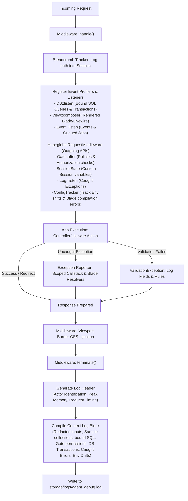

# The Vision & Architecture

The **Laravel Agent-Debugger** was conceived to solve the silent data loss, performance crises, and layout rendering bugs that plague modern web development pipelines—specifically targeting workflows commonly prone to newbie or junior developer errors.

---

## The Vision: High-Fidelity, Server-Driven Simplicity

Modern developer toolkits are heavily bloated with client-side JavaScript, third-party iframe overlays, or browser extensions. This works in a standard HTML-only template but breaks instantly when using:
1.  **Inertia.js (Vue/React)**, where HTML body injections interfere with shadow DOM diffing.
2.  **Livewire v3 Component Actions**, where DOM updates are hijacked, resulting in polling errors.
3.  **Headless REST APIs & Mobile Backends**, where there is no browser window to display developer console blocks.

Our vision is a **100% server-driven diagnostics suite** that logs structured, context-rich request lifecycles directly into localized files. By moving diagnostic collection to the backend:
*   We get a unified output format regardless of the client-side technology stack (Blade, Vue, React, Livewire, Android/iOS API clients).
*   Logs remain safe, secure, and easily parseable by humans and AI coding agents alike.
*   We ensure strict environment isolation, keeping production code fast and clean.

---

## Design Philosophy

### 1. Zero Dependency
The package has a zero external dependency requirement (outside Laravel framework core packages). It is lightweight and drops seamlessly into any PHP 8.3+ project under `"require-dev"`.

### 2. High Signal-to-Noise Ratio
We redact high-frequency framework events and secure database passwords. We preserve context samples rather than dumping full Eloquent collection objects, ensuring logs remain readable.

### 3. Contextual Relationships
Rather than logging isolated metrics (like "CPU time" or "raw memory"), we connect data points:
*   We interleave transaction commit and rollback states directly *inside* database queries.
*   We map exception stack traces back to their parent Blade views.
*   We link request history trails together via session breadcrumbs to reconstruct user paths.

---

## Technical Data Flow Pipeline

The system acts as a global middleware pipeline that captures state changes across multiple container hooks:

---

## Performance Considerations
All extensive compiling, string interpolation, recursive redactions, payload truncations, and disk writes occur during the **`terminate()` middleware hook**, which executes *after* the client has successfully received the HTTP response. This guarantees near-zero latency impact for developer testing sessions.
